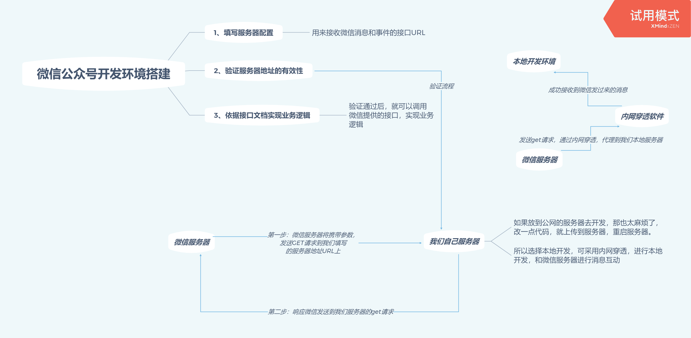

# 微信公众号开发简介

在我们开始介绍微信公众号，开发环境搭建的时候，我们现在脑海中，想像这样一幅画面，有这样的三个人：

* A: 卖房子的中介---名叫微信服务器
* B：房子的主人----我们自己服务器（项目，产品）
* C：想买你房子的客户----进入公众号的客户

此时客户想买房子，那么他就要到中介那里（微信服务器）看房子，最后看中你的房子，
此时中介就会和你勾兑，有个客户，看中了你的房子，想来看看你的房子，然后中介就带着客户到你的房子参观，参观后这个房子的感受，都会通过中介反馈给你，然后后你和中介沟通，把你的想法等等反馈给客户。这样的场景就等同于我们进入微信，点击微信公众号，所进行一系列操作。

## 中介--微信服务器

当用户进入微信公众号时，一个完成的交互流程如下：

* 第一步：用户打开微信进入公众号。
* 第二步：在公众号中操作。
* 第三步：消息传入微信服务器。
* 第四步：微信服务器把消息体传给你的服务器。
* 第五步：你的服务器处理完返回微信。
* 第六步：微信接收你的返回处理完返回用户。

我们可以看见，这里涉及到微信服务器把，用户发送的消息和操作行为，发送的我们自己服务器中，我们接受到微信服务器发送的消息，然后对这些消息进行应答，然后微信服务器，把我们的回答返回给用户，微信服务器在这里面，就是充当一个**中介**


## 房子的主人（我们自己公众号服务器）如何跟中介打通关系，建立联系

* 1、填写服务器配置----需要在微信公众号后台进行配置
* 2、验证服务器地址的有效性----具体可参考下面示例code
* 3、依据接口文档实现业务逻辑----第二步验证成功后，你就可以愉快的实现你的code

```javascript
// 验证服务器地址的有效性--示例代码
/*
 * 1）将token、timestamp、nonce三个参数进行字典序排序
 * 2）将三个参数字符串拼接成一个字符串进行sha1加密
 * 3）开发者获得加密后的字符串可与signature对比，标识该请求来源于微信
 */
function checkToken (ctx) {
  const token = wechatConfig.token // 微信公众号后台配置token
  const nonce = ctx.request.query.nonce // 微信发送get请求参数
  const timestamp = ctx.request.query.timestamp
  const echostr = ctx.request.query.echostr
  const signature = ctx.request.query.signature
  // 将Token，timestamp，nonce按字典排序,排序后链接成一个字符串
  const str = [token, timestamp, nonce].sort().join('')
  // 使用sha1模块进行sha1加密
  const sha1Str = sha1(str)
  // 判断加密后的字符串与请求中signature是否相等, 如果相等返回echostr
  if (sha1Str === signature) {
    ctx.body = echostr
  } else {
    ctx.body = 'fail'
  }
}
```

>微信公众号接入流程



>内网穿透Natapp的使用教程，就不在这里赘述了，大家可以参看这篇教程进行操作。

[本地开发神器，内网穿透--微信服务器和本地开发环境，交流的中介商](https://natapp.cn/article/wechat_local_debug)

## 买房子的客户

你就是尊贵的客户大大，你想咋操作就咋操作！微信公众号的开发，大致的流程就是如上所述了。