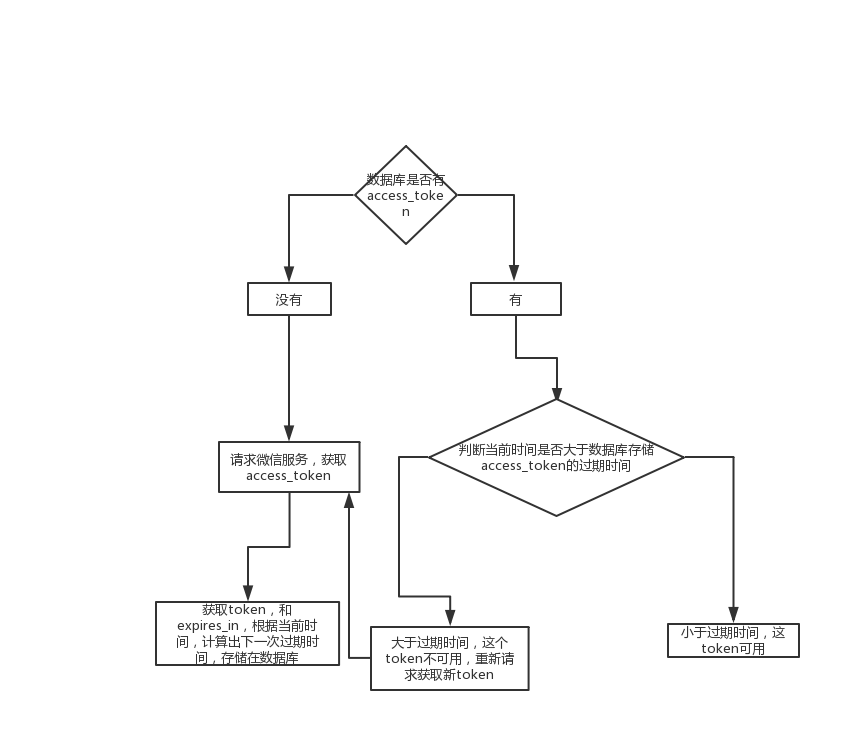

# access_token票据的管理

我们看一下官方对access_token的定义：
* access_token是公众号的全局唯一接口调用凭据，公众号调用各接口时都需使用access_token
* access_token的有效期目前为2个小时，需定时刷新，重复获取将导致上次获取的access_token失效
  
联系我们上次的人物关系：微信服务器是一个中介服务商，我们是拥有房子的人，我们每次向中介询问我们
房子售卖情况，是不是都得联系中介，那我们怎么联系中介呢，此时就需要一种沟通方式，例如:
电话，qq、微信等等，这个联系方式是不是等同于access_token。只不过这个联系方式，在每隔两个小时
变化一次而已。像不像暗号，还有点冒险、浪漫的感觉~


## 如何获取和存储access_token呢？

* 请求微信服务器获取access_token接口，按照要求传递参数，正常情况下`{"access_token":"ACCESS_TOKEN","expires_in":7200}`
* 根据当前时间，记录过期时间(当前时间 + expires_in -100)，过期时间需要提前100毫秒（可根据自己项目，自定义），为什么要提前呢？
以防出现其他特殊情况，导致旧的access_token不可用，所以需要提前刷新access_token。
* 把获取access_token和过期时间，存储到数据库。
* 每次请求微信接口时，根据当前时间和过期时间对比，一旦发现当前时间大于过期时间，刷新access_token, 更新数据库的access_token和
过期时间。

```javascript
// 获取token--示例code
updateAccessToken () {
    const url = wehchatConfig.apiUrl + `/cgi-bin/token?grant_type=client_credential&appid=${this.opts.appId}&secret=${this.opts.appsecret}`
    const responseData = await this.fetchRequest({
      url,
      method: 'GET'
    })
    const now = new Date().getTime()
    // 在过期的两个小时，提前100毫秒过期，以防出现token过期无法处理的其他问题
    const expiresIn = now + (responseData.expires_in - 100) * 1000
    responseData.expires_in = expiresIn
    return responseData
}
```
>其流程如下图：

