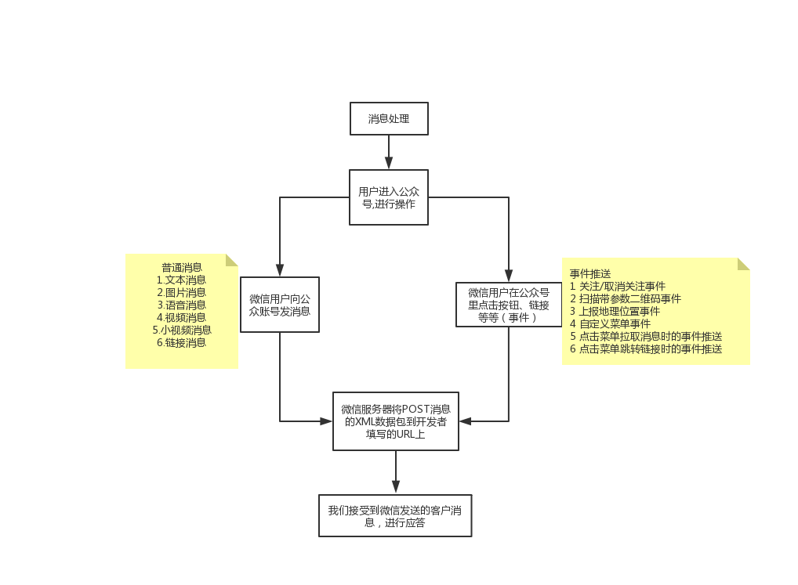

# 微信消息管理

> 微信服务器、微信公众号、用户他们三者的交流示意图




**示例，回复普通消息模板**

```javascript
class BaseMessage {
  constructor (option) {
    this.createTime = option.createTime
    this.msgType = option.msgType
    this.toUserName = option.fromUserName
    this.fromUserName = option.toUserName
  }

  getTpl () {
    return `<ToUserName><![CDATA[${this.fromUserName}]]></ToUserName>
                <FromUserName><![CDATA[${this.toUserName}]]></FromUserName>
                <CreateTime>${this.createTime}</CreateTime>
                <MsgType><![CDATA[${this.msgType}]]></MsgType>`
  }
}

// 文本模板
class TextMessage extends BaseMessage {
  constructor (option) {
    super(option)
    this.content = option.content
  }

  getMessageTpl () {
    const baseTpl = this.getTpl()
    return `<xml>
        ${baseTpl}
        <Content><![CDATA[${this.content}]]></Content>
    </xml>`
  }
}
```


**示例，回复事件推送**

```javascript
async function reply (ctx) {
  const message = ctx.weixin
  switch (message.MsgType) {
    case 'text':
      // 消息文本，用户输入什么，就回复什么
      ctx.body = message.Content
      break
    case 'image':
      ctx.body = {
        type: 'image',
        mediaId: message.MediaId
      }
      break
    case 'voice':
      ctx.body = {
        type: 'voice',
        mediaId: message.MediaId
      }
      break
    case 'video':
      ctx.body = {
        type: 'video',
        title: '唱跳rap',
        description: '下雨天，你喜欢吗',
        mediaId: message.MediaId
      }
      break
    case 'location': // 位置信息
      ctx.body = `你现在的定位的位置如下\nx坐标${message.Location_X}，
            y坐标为${message.Location_Y}，地址为${message.Label}`
      break
    case 'link': // 链接信息
      ctx.body = {
        type: 'news',
        articles: [
          {
            title: message.Title,
            description: message.Description,
            picUrl: 'https://avatars2.githubusercontent.com/u/15865210?s=460&v=4',
            url: message.Url
          }
        ]
      }
      break
    case 'event': // 事件处理
      // 订阅
      if (message.Event === 'subscribe') {
        ctx.body = '终于来看我啦~~~'
        // 取消订阅
      } else if (message.Event === 'unsubscribe') {
        console.log('你怎么走了~~~~~')
      }
  }
}

```