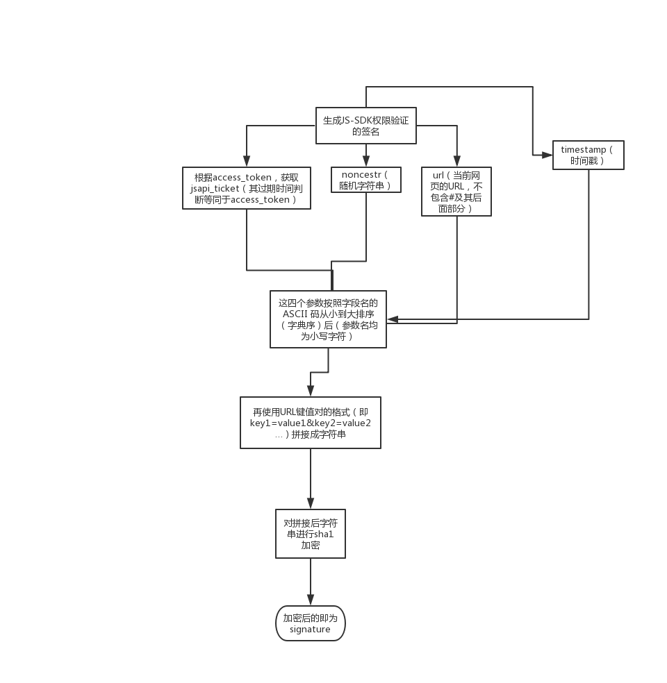

# 微信JS-SDK

定义（官网）：是微信公众平台 面向网页开发者提供的基于微信内的网页开发工具包，通过使用微信JS-SDK，网页开发者可借助微信高效地使用拍照、选图、语音、位置等手机系统的能力，同时可以直接使用微信分享、扫一扫、卡券、支付等微信特有的能力，为微信用户提供更优质的网页体验。


> JSSDK使用步骤(官网都有详细的介绍)

* 步骤一：绑定域名
* 步骤二：引入JS文件
* 步骤三：通过config接口注入权限验证配置
* 步骤四：通过ready接口处理成功验证
* 步骤五：通过error接口处理失败验证

**我们主要关注，如何生成wx.config里面参数**

```javascript
wx.config({
  debug: true, // 开启调试模式,调用的所有api的返回值会在客户端alert出来，若要查看传入的参数，可以在pc端打开，参数信息会通过log打出，仅在pc端时才会打印。
  appId: '', // 必填，公众号的唯一标识
  timestamp: , // 必填，生成签名的时间戳
  nonceStr: '', // 必填，生成签名的随机串
  signature: '',// 必填，签名
  jsApiList: [] // 必填，需要使用的JS接口列表
});
```

## 微信JSSDK的config参数的获取




**示例代码**

```javascript
 // 获取jsapi_ticket
  async updateTicket (access_token) {
    // access_token-参见上几章的access_token管理
    const url = wechatConfig.apiUrl + `/cgi-bin/ticket/getticket?access_token=${access_token}&type=jsapi`
    const responseData = await this.fetchRequest({
      url,
      method: 'GET'
    })
    const now = new Date().getTime()
    // 在过期的两个小时，提前20毫秒过期，以防出现Ticket过期无法处理的其他问题
    const expiresIn = now + (responseData.expires_in - 20) * 1000
    responseData.expires_in = expiresIn
    return responseData
  }

  // 生成随即字符串
  const noncestr = Math.random()
        .toString()
        .substr(2, 12)

  // 生成时间戳
  const timestamp = parseInt(new Date().getTime() / 1000) + ''

  // 生成签名规则
  function getSignature (signParams) {
    // 1. 对所有待签名参数按照字段名的ASCII 码从小到大排序（字典序）
    let keys = Object.keys(signParams)
    let resStr = ''
    const resObj = {}
    keys = keys.sort()

    // 2.URL键值对的格式（即key1=value1&key2=value2…）拼接成字符串string1
    // 这里需要注意的是所有参数名均为小写字符
    keys.forEach(key => {
        resObj[key.toLowerCase()] = signParams[key]
    })

    // 拼接成字符串
    for (const i in resObj) {
        resStr += `&${i}=${resObj[i]}`
    }
    // 对字符串进行sha1进行加密
    return sha1(resStr.substring(1))
  }
```