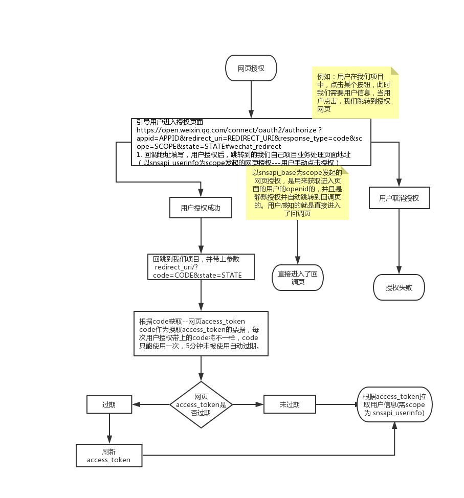

# 微信网页授权

官方定义：如果用户在微信客户端中访问第三方网页，公众号可以通过微信网页授权机制，来获取用户基本信息，进而实现业务逻辑

> 其流程如下图




## 授权的具体步骤

* 1 第一步：用户同意授权，获取code
* 2 第二步：通过code换取网页授权access_token
* 3 第三步：刷新access_token（如果需要）
* 4 第四步：拉取用户信息(需scope为 snsapi_userinfo)
* 5 附：检验授权凭证（access_token）是否有效


### 第一步：用户同意授权，获取code

```html
<div>
    <h1>Hello world!</h1>
    <div @click="handleAuth">网页授权</div>
</div>
```

```javascript
// 伪代码, 求情后端接口，前端处理，获取跳转地址
handleAuth () {
    api.get('/wechat/authorizeUrl', {
      params: { a: 2, b: 3 },
    })
}

// 后端处理
// 获取授权地址, scope 为snsapi_base snsapi_userinfo
async getAuthorizeUrl (scope, redirectUrl, state) {
    const reqUrl = `${api.oAuth}appid=${wechatConfig.appId}&redirect_uri=${redirectUrl}&response_type=code&scope=${scope}&state=${state}#wechat_redirect`
    return reqUrl
}

// 获取授权地址
async function getAuthorizeUrl (ctx) {
  const scope = 'snsapi_userinfo'
  // 你配置的回调地址
  const redirectUrl = encodeURIComponent(wechatConfig.siteRootUrl + '/oauth')
  const { a, b } = ctx.request.query
  // 回调地址链接上，携带的参数
  const state = `${a}_${b}`
  const oAuthUrl = await oAuth.getAuthorizeUrl(scope, redirectUrl, state)
  // 跨域处理
  ctx.set('Access-Control-Allow-Origin', 'http://xx.api.com')
  ctx.body = {
    url: oAuthUrl
  }
}
```

## 后面几步：通过code换取网页授权access_token, 换取用户信息

**一旦，用户授权成功后，我们其跳转地址为我们填写回调地址例如：**

```javascript
https://xx.api.com/?code=2323&state=1-2
```

此时，我们在授权回调页面，可以进行我们业务操作

```javascript
// 获取用户信息（以下为伪代码）
async function getUserInfo (ctx) {
  const code = ctx.request.query.code
  // 根据code获取网页access_token和用户的opneid
  const tokenData = await fetchToken(code)
  // 根据access_token和openid获取用户信息，返回给前端
  // 进行业务处理
  const userInfoData = await fetchUserInfo(tokenData.access_token, tokenData.openid)
  console.log('网页授权获取的用户信息', userInfoData)
  ctx.body = userInfoData
}

```

----------------------------------------------------------------

最后：上面就是整个网页oAuth2.0授权的流程了