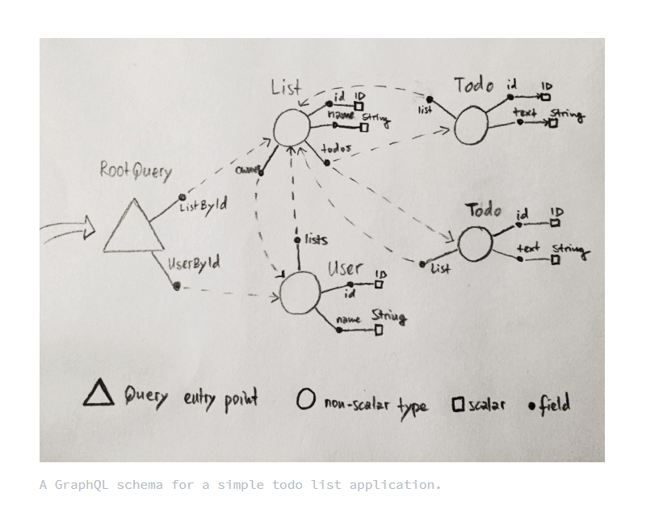

## 定义

`GraphQL` 是一种用于设计和查询数据的领域特定类型语言（`Domain Specific Language`即`DSL`）。

定义的每个字我们都认识，但是连起来还是似懂非懂的感觉，我们拆分一下其定义：

1.  是一个语言（即一种规范）即定义了这种查询语言语法如何、具体的语句如何执行等。

答：就比如人饿了，需要吃饭，那么我们都需要吃饭，你想吃什么就吃什么。那么就允许任何人用任何编程语言实现 `GraphQL`这个规范，例如`JavaScript` 中有一个官方实现叫做 `graphql-js`的包，这个包就实现 `GraphQL`的规范。我们可以这样类比：`GraphQL`和的`graphql-js`关系, 就像 `EcmaScript` 与 `JavaScript` 的关系。

2. 类型语言，其中类型的意思，指的是什么？

答：就类似于`ts/java`, 每一个字段，都要其特定的类型，静态检查会检测类型。

3. 领域特定语言，领域特定这个词应该如何理解呢？

答：例如`html`, `css`这些只能单一作用于浏览器，那么就被称为领域特定语言，`js`这门语言，既可以用于前端开发，
又可以用于服务端，那么这样的语言就被成为同样语言。

4. 可以设计数据，同时也可以查询数据？

答：在server对返回的数据进行建模`originData`，客户端用graphql编写查询来获取在服务端设计的数据`originData`。

## 前端`graphql-js`/后端`express-graphql`和http的关系

前端`graphql-js`和后端`express-graphql`，这两个包都是实现了GraphQL这个语言规范包。让开发者可以在客户端和服务端，使用GraphQL这个语言进行对api查询。前后端的通信通过http协议进行交流的（当然还有其他协议），GraphQL的查询，是建立在前后端交流的基础之上，如果双方都不能交流，那么就不存在前端查询后端数据的了。


## graphql代表什么

graph + query + language => 图表查询语言



上图是一个简单的todo应用的grahql的schema

从图形的角度考虑架构, 类型是图形的节点(list todo)，字段是边(例如：id name text)，标量类型没有字段(ID Sting等等)，因此它们构成了图形的叶节点。
GraphQL 查询只是以特定方式遍历图的指令，从而生成一棵树。遍历树时，您将从根开始，但是图没有根，因此没有逻辑起点！
这就是为什么每个 GraphQL 模式都需要有一个根查询类型：它是图的入口点。根查询类型的字段是指向 GraphQL 服务器支持的实际查询的链接。

GraphQL 查询只是关于如何遍历图的一组指令。即
1. 用户可以遍历哪些边（即从一个字段查询其关联下一个或者多个字段）
2. 用户可以访问哪些节点 （即获取到需要的数据）

## 几个核心概念
  * Schema
  * Type
  * Query
  * Mutation
  * Subscribe
  * Resolver

### schema（模式）

它定义了服务器的 API，让客户端知道服务器可以执行哪些操作。是graphql服务的入口和骨架。
可以说没有schema，那么就没法创建一个graphql服务。必须有了schema才能执行下一步。
例如上图那个TODO应用的例子，schema就代表整个图表（或者树），所有里面的节点，枝叶都是
包含在其中的。

那么TODO应用的schem是如何定义呢：

```graphql

# 一个graphql服务，可以没有mutation subscription 但是必须有query

schema {
  query: Query
  # mutation: Mutation
  # subscription: Subscription
}

type Query {
  ListById(id: ID!): List
  UserById(id: ID!): User
}

type List {
  id: ID!
  name: String!
  todos: [TODO]
  owner: User!
}

type User {
  id: ID!
  name: String!
  lists: [List]
}

type TODO {
  id: ID!
  text: String!
  list: [List]
}

```

### Type

1. Scalars/标量 （等同js中的简单类型）
2. Objects/对象 （等同js中的对象）
3. Interfaces/接口 （ts,java中接口）
4. Unions/联合 （ts的unions类型）
5. Enums/枚举型 （js的枚举）
6. Input Objects/输入对象 （js对象）
7. Lists/列表型 （数组）
8. Non-Null/非空型 （ts的非空验证数据）

下面是graphql内置的5种标量

* Int：有符号 32 位整数。
* Float：有符号双精度浮点值。
* String：UTF‐8 字符序列。
* Boolean：true 或者 false。
*  ID：ID 标量类型表示一个唯一标识符，通常用以重新获取对象或者作为缓存中的键。
ID 类型使用和 String 一样的方式序列化；然而将其定义为 ID 意味着并不需要人类可读型。

graphql中的每个字段，都有所属的类型。这里也能表面graphql是一个类型语言

## 看一个例子

## 如何在项目中运用

## 优点缺点以及优化的api的使用不做介绍

## 参考文档