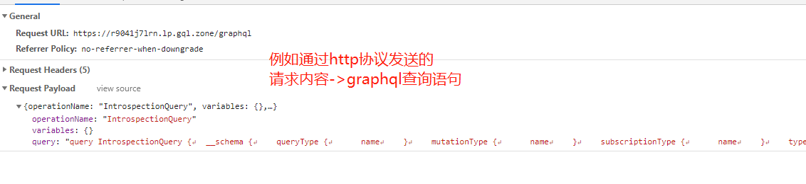
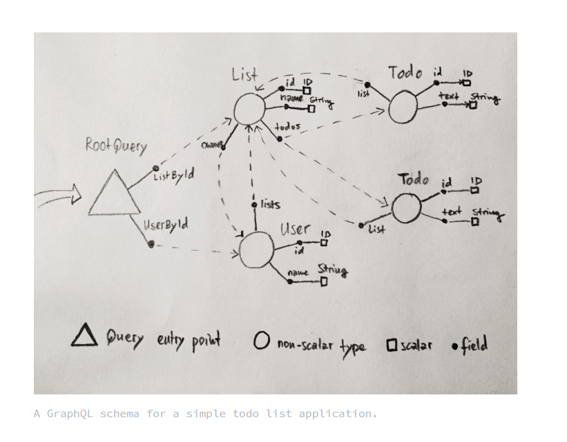

# 定义

`GraphQL` 是一种用于设计和查询数据的领域特定类型语言（`Domain Specific Language`即`DSL`）。

定义的每个字我们都认识，但是连起来还是似懂非懂的感觉，我们拆分一下其定义：

1.  是一个语言（即一种规范）即定义了这种查询语言语法如何、具体的语句如何执行等。

答：就比如人饿了，需要吃饭，那么我们都需要吃饭，你想吃什么就吃什么。那么就允许任何人用任何编程语言实现 `GraphQL`这个规范，例如`JavaScript` 中有一个官方实现叫做 `graphql-js`的包，这个包就实现 `GraphQL`的规范。我们可以这样类比：`GraphQL`和的`graphql-js`关系, 就像 `EcmaScript` 与 `JavaScript` 的关系。

2. 类型语言，其中类型的意思，指的是什么？

答：就类似于`ts/java`, 每一个字段，都要其特定的类型，静态检查会检测类型。

3. 领域特定语言，领域特定这个词应该如何理解呢？

答：例如`html`, `css`这些只能单一作用于浏览器，那么就被称为领域特定语言，`js`这门语言，既可以用于前端开发，
又可以用于服务端，那么这样的语言就被成为同样语言。

4. 可以设计数据，同时也可以查询数据？

答：在server对返回的数据进行建模`originData`，客户端用GraphQL编写查询来获取在服务端设计的数据`originData`。

## `graphql-js`和http的关系

`graphql-js`，这个包实现了GraphQL这个语言规范。让开发者可以在客户端和服务端，使用GraphQL这个语言对数据进行查询。前后端的通信通过http协议进行交流的（当然还有其他协议），GraphQL的查询，是建立在前后端交流的基础之上，如果双方都不能交流，那么就不存在前端查询后端数据的了。

```js
// ====== 服务端 ======
var express = require('express');
// express-graphql是一个创建 Express 服务的简单方法来运行 GraphQL API
var { graphqlHTTP } = require('express-graphql');
var { buildSchema } = require('graphql');
 
// 使用 GraphQL Schema Language 创建一个 schema
var schema = buildSchema(`
  type Query {
    hello: String
  }
`);
 
// root 提供所有 API 入口端点相应的解析器函数
var root = {
  hello: () => {
    return 'Hello world!';
  },
};
 
var app = express();
app.use('/graphql', graphqlHTTP({
  schema: schema,
  rootValue: root,
  graphiql: true,
}));
app.listen(4000);
console.log('Running a GraphQL API server at http://localhost:4000/graphql');


// ====== 客户端 ======
fetch('/graphql', {
  method: 'POST',
  headers: {
    'Content-Type': 'application/json',
    'Accept': 'application/json',
  },
  // 这里就是我们发送的数据，硬编码的字符串查询
  body: JSON.stringify({query: "{ hello }"})
})
  .then(r => r.json())
  .then(data => console.log('data returned:', data));
```



一旦我们应用变得复杂，我们就不能采用那种硬编码的方式进行查询，需要

## GraphQL代表什么

我们把GraphQL拆分来看`graph + query + language => `图表查询语言, `language`这个很直白，就是一种语言规范，我们重点来分析`graph`和`query`这个两个词，**可以理解为从图表中查询你需要的东西**

例如：下图就是一个简单的todo应用的GraphQL schema



我们从图形的角度来看上图

1. 首先从图表查询数据的话，我们需要一个入口，就如我们走迷宫的时候，得告诉我们起点从哪里开始。这个就对应GraphQL的Root Query，这个是必须的, 且一个GraphQL应用只有一个入口，即一个Root Query。

```js
type Query {
  listById: [List]
  userById: User
}
```

2. 图表圆形（例如：`Todo, List, User`）节点，就对应树树干的节点，在GraphQL中称之为类型（即type）, 实心小圆点（例如：`id name text`），就对应树的枝叶，这些称之为叶子节点，而小正方形的（例如：`ID Strig`）就是这些叶子节点的类型。

```js
// 自定义类型User, 即树干节点
type User {
  // id name对应枝叶，ID String对应枝叶节点的类型
  id: ID!
  name: String!
}
```

从上图我们大致明白Graph这个词所代表的图表，这个图表的骨架就对应GraphQL服务的`Schema`。

**GraphQL 查询的query的理解**

GraphQL 查询只是以特定方式遍历图的指令，从而生成一棵树。遍历树时，我们需要从根开始，但是图没有根，因此没有逻辑起点！这就是为什么每个 GraphQL 模式都需要有一个根查询类型：它是图的入口点。从这个入口查询（query）我们需要的节点信息。

GraphQL 查询只是关于如何遍历图的一组指令。即
1. 用户可以遍历哪些节点（即从一个字段查询其关联下一个或者多个字段）
2. 用户可以访问哪些节点 （即获取到需要的数据）

从上面我们可以应该，对GraphQL有了一个大概的理解。接下来我们进一步的GraphQL进行学习。