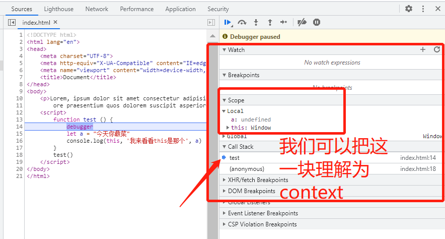

# context(上下文)是指什么，它与this关系是什么呢

## 我们首先的建立这样的认知

1. 当一个函数被调用的时候，会创建一个context（执行上下文）
2. context包含this，即context>this
3. this是context的一个属性

我们来通过一个例子具体来讲，在函数调用的时候，context和this到底代表的是什么?

**我们先看一下context的定义：**

1. 执行环境定义了变量或函数有权访问的其他数据，决定了它们各自的行为。
2. 每个执行环境都有一个与之关联的`变量对象`，环境中定义的所有变量和函数都保存在这个对象中。
3. 代码中是无法访问这个变量对象的，但是解析器在处理数据时会用到。
4. Web浏览器中，全局执行环境会被认为是window对象，因此所有的全局变量和函数都是作为window对象的属性和方法创建的。
5. 每个函数在被调用时也会创建自己的执行环境

我们从这个定义，结合下面这个例子，进行翻译理解一下

```js
// 声明了一个名为test的函数
 function test () {
    debugger
    let a = "今天你最菜"
    console.log(this, '我来看看this是那个', a)
}
// 调用这个函数
test()
```

1. 调用test函数的时候，会创建以一个当前函数的执行环境，而这个执行环境所有的信息就记录到一个变量对象
2. 这个变量对象就是context, 这变量我们代码获取不到，但是我们通过浏览器断点调试大致明白这个对象



context可以等同于大红框里面，记录了test函数，被哪里调用（即call stack）, 函数的调用方式，传入的参数，函数里面变量等等等。
3. 我们可以从截图中看出，此时this代表的是window对象。this是包含在变量对象context中的，即只是变量对象context的一个属性而已。

从上面这个例子，我们可以验证上面结论：

1. context > this
2. context我们代码访问不到
3. 函数调用就是参数一个context（执行上下文）
4. this只是这个context的一个属性

### this

通过上面我们知道context到底是什么呢，context和this的关系了，那么this是个什么呢？它是如何确定呢？例如这个例子中，调用test, this为什么是window对象，这些疑问都需要我们解决，可以看我对this的理解那篇文章

> 最后，以上是本人从书中，教程，以及各位大佬分享的博文中，学习感悟总结得出，如果错误，还请各位小伙伴指正！
