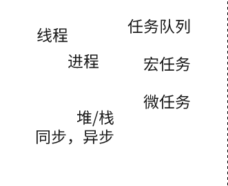

# Event Loop事件循环

要了解事件循环到底是什么的话，我们要在脑海里，对以下概念有清晰的认识。



## 前置概念解析

为了更好理解上述概念，我们把上述概念根据关联关系，分成以下几对进行概述。

* 堆(heap)/栈(stack)内存
* 进程（process）和线程（thread）
* 同步（Synchronous）task/异步（Asynchronous）task
* 任务队列/宏任务/微任务

### 堆(heap)/栈(stack)内存

1. 堆（heap）内存：主要负责像对象Object大小不固定的变量类型存储。

2. 栈(stack)内存：主要用于存储各种基本类型的变量，包括Boolean、Number、String、Undefined、Null，对象变量的指针。


### 进程（process）和线程（thread）

1. 打开chrome浏览器的时候，就会出现一个或者多个进程, 在window上可以使用tasklist命令查看

```
C:\>tasklist

映像名称                       PID 会话名              会话#       内存使用
========================= ======== ================ =========== ============
System Idle Process              0 Services                   0          8 K
chrome.exe                   16152 Console                    1    112,276 K
```

2. 进程（process）= 线程1（thread）+ 线程2（thread）+....(进程由多个线程组成)
3. 进程是cpu资源分配的最小单位（是能拥有资源和独立运行的最小单位）
线程是cpu调度的最小单位（线程是建立在进程的基础上的一次程序运行单位，一个进程中可以有多个线程）
4. **js是单线程**：我的直白理解就是，js只有一个人来服务这些code，code需要排队执行

对于这部分内容，如果不是很了解的话或者没有这方面的基础，还是建议大家补一下计算器的基础，上面的这部分只是一个非常浅显的总结。

### 同步（Synchronous）task/异步（Asynchronous）task

对于同步（Synchronous）task/异步（Asynchronous）task的理解，我们可以看下面这个例子：

1. 你去食堂吃饭，此时食堂只有一个窗口，且只有一个打饭的阿姨，此时排队吃饭共有10人，此时阿姨（服务者）
他每次只能给一个人打饭，才能给下一个人（客户）打饭：那么总结来说就是，服务者每次只能服务一个客户，
下一个客户只能服务者完成上一个客户，才能享受服务。

2. 还是上面那个例子，当你排队的时候，如果阿姨（服务者）正常给其他人打饭，给你一个排号，等他把这个客人
处理好了，喊到号码轮到你的时候你再来，此时你不需要一直在这里干等着，此时你可以去占桌子，买点奶茶什么的。

那是不是可以理解：
1. 第一种情况，你只能等前面的人全部打完饭了，你才知道轮到你了，你可以打饭了。
2. 第二种情况，有通知系统告诉到你了，你什么时候可以打饭，在等待时候，你可以做其他事情。
3. 同步任务就是，我必须等前一个任务执行完成，我才能执行。异步任务，我不必傻傻等着前面任务执行，有人通知我在什么时候可以执行了。

>那么同步和异步最直接的区别：就是有没有人通知你，什么时候该你上了，没人通知，只能自己看进度干等！有人通知，就可以在等的时候做其他事情。那换句话说，这两种最本质的区别其实在于，获取消息机制的不同。即同步和异步的目的都是干饭，只是同步要一直看进度等着看是否排到了自己。而异步可以把干饭这件事情，先放到一边，等人通知了，再来干饭。


总结(自我理解)：由于js是单线程的，意味着只有一个服务员，如果异步任务的人，在等待的时候，去做其他任务，那就没有服务员了服务这些其他任务，
所以需要把其他任务存储起来，等当前服务员把这些当前同步任务完成后，再按照顺序依次服务其他任务队列，这个对于js中的任务队列

### 事件循环

单线程的js -> 主线程（Main Thread）-> 渲染进程（Renderer Process）

* 宏任务
  * script(整体代码)
  * setTimeout
  * setInterval
  * setImmediate
  * I/O
  * UI render
* 微任务
  * process.nextTick
  * Promise
  * Async/Await(实际就是promise)
  * MutationObserver(html5新特性)

### 参考文档

[进程与线程的一个简单解释](https://www.ruanyifeng.com/blog/2013/04/processes_and_threads.html)
[线程和进程的区别是什么？](https://www.zhihu.com/question/25532384)
[如何理解：程序、进程、线程、并发、并行、高并发？](https://www.zhihu.com/question/307100151/answer/894486042)
[浅析JS中的堆内存与栈内存](https://www.cnblogs.com/heioray/p/9487093.html)
[Loupe是一种可视化工具，可以帮助您了解JavaScript的调用堆栈/事件循环/回调队列如何相互影响](http://latentflip.com/loupe/)
[JavaScript中的Event Loop（事件循环）机制](https://zhuanlan.zhihu.com/p/145383822)