# viewport

## viewport的定义

> viewport的中文翻译：视口，视窗

根据中文翻译，在我们前端工作中，我能联想到，电脑显示器，手机屏幕，浏览器窗口，移动端常用的meta标签
`<meta name="viewport" content="width=device-width, initial-scale=1.0">`这些内容跟viewport相关。

viewport的定义： Web 浏览器术语中，通常与浏览器窗口相同，但不包括浏览器的 UI， 菜单栏等——即指你正在浏览的文档的那一部分，
即浏览器的窗口的宽高（ 在桌面浏览器上如此，移动设备浏览器上有点复杂）

## 通过示例加深理解

viewport代表着浏览器窗口的宽度高度，当我们看到这句话，会产生这些疑问：

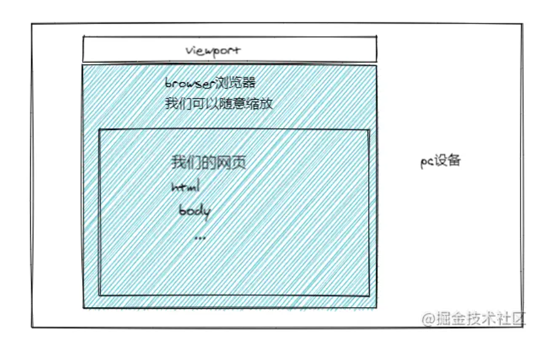

1. 这个宽高包含浏览器滚动条吗？
2. 这个宽高如何获取呢？
3. 这个窗口的宽高具体是那部分呢？

**这个宽高包含浏览器滚动条吗？**

答：不包含，因为他是浏览器窗口的宽高，而浏览器出现的滚动条是，由于html内容撑开的，所以浏览器本身宽高。


**这个宽高如何获取呢？**

答：`document.documentElement.clientWidth/Height`

> tip: 从上图我们可以看出，viewport是包含html内容的，但是这里有一个特殊点，我们知道`documentElement`代表的html元素，但是这个`document.documentElement.clientWidth/Height`却代表的是视口的宽高，并不是html元素的宽高，如果要获取html元素的宽高，需要使用`document.documentElement.offsetWidth/Height`

**那viewport代表着浏览器窗口的宽度高度 , 这个宽高具体是那部分呢？**

答：viewport代表着浏览器内容展示窗口（html文档内容）的宽高，随着浏览器的窗口缩放而改变，不随着html内容大小的更改而更改。

**我们从这几个方面，进行验证**

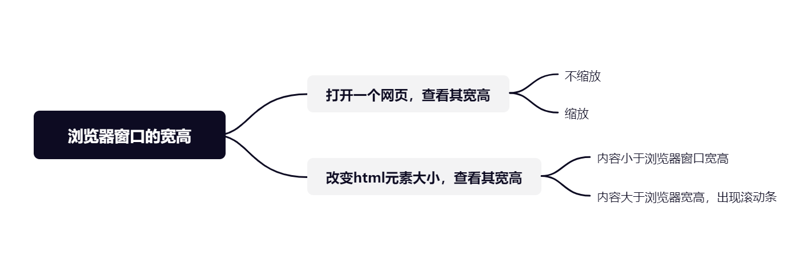


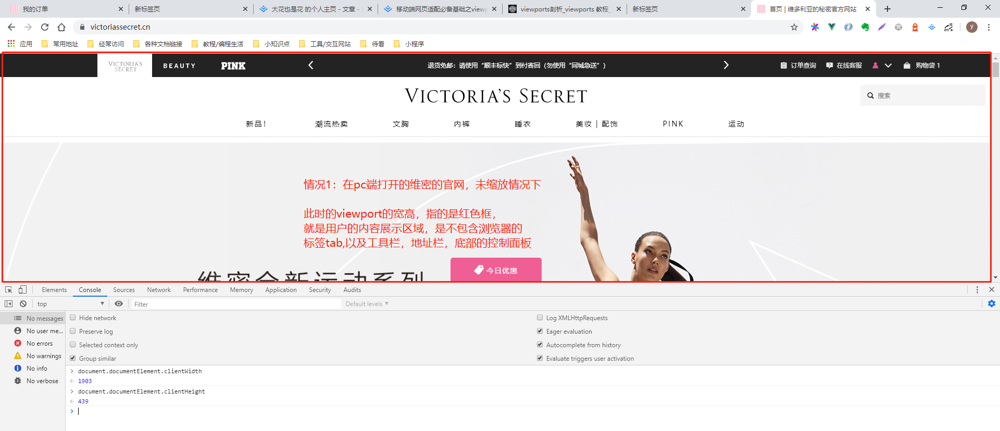
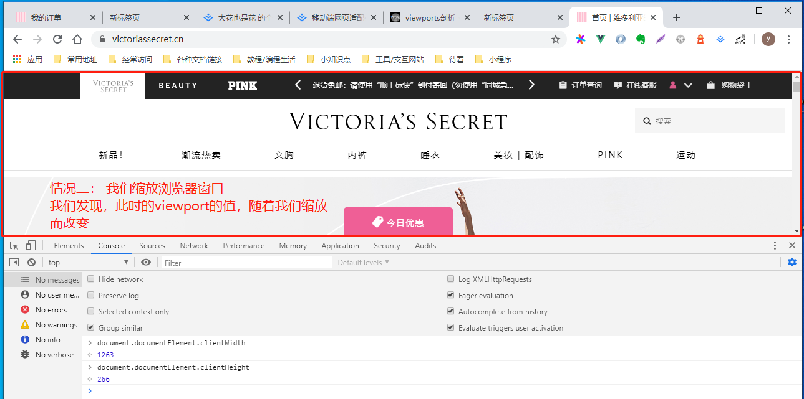
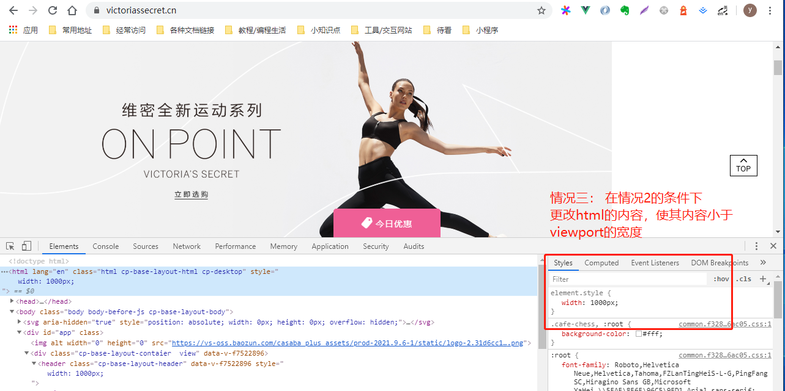
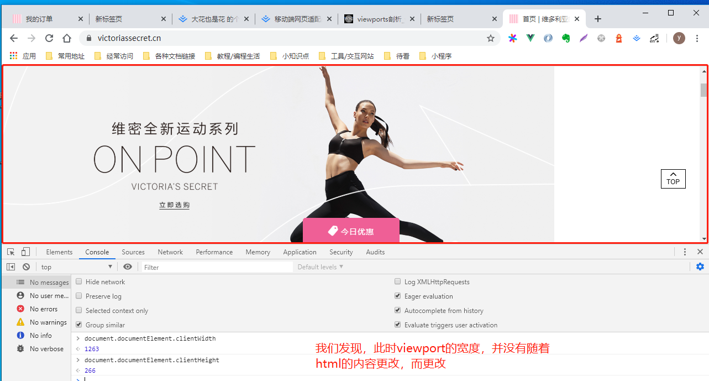
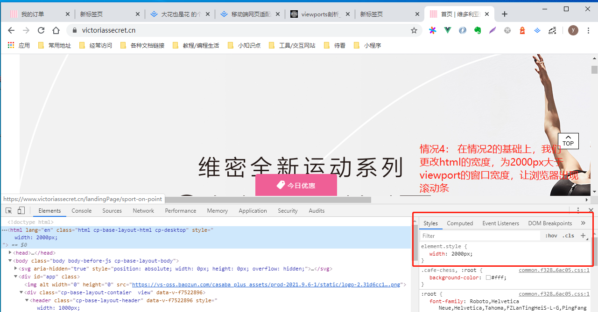
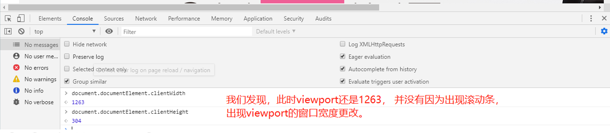

## viewport在@media的应用

```css
@media only screen
    /* 这个宽度是指的viewpoint视口的宽度 */
  and (min-width: 1100px) {
    body {
        background: red;
    }
}
```
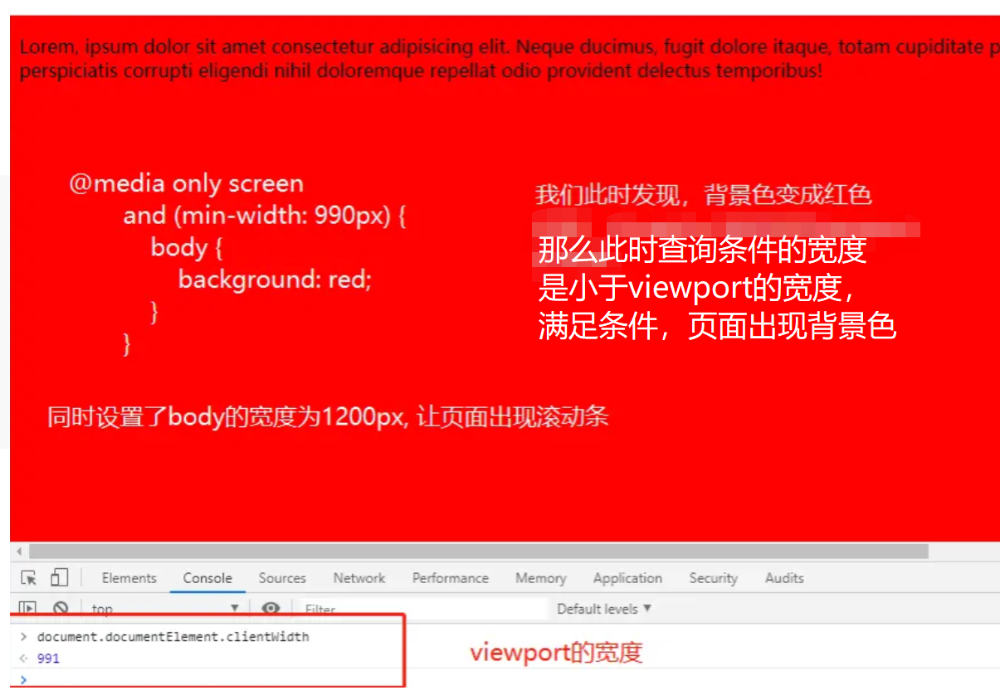
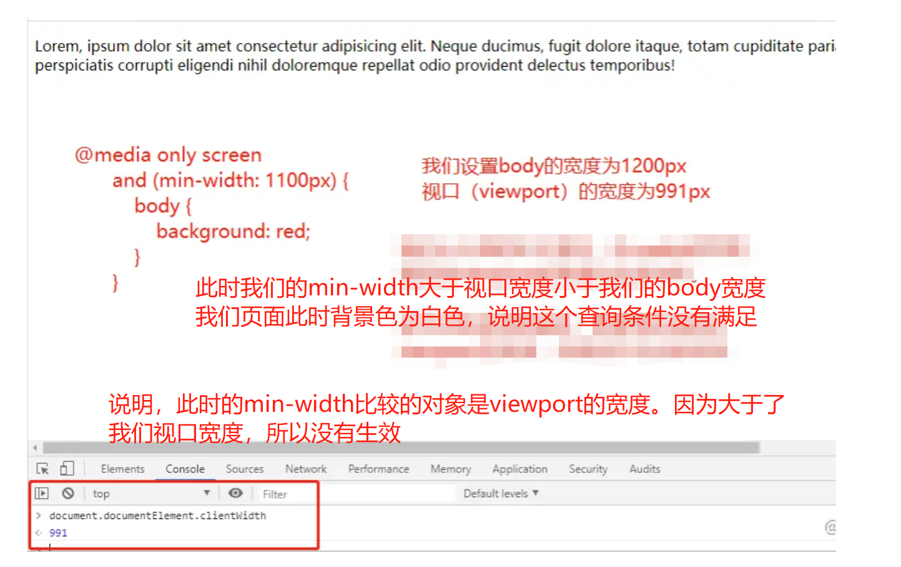

**从上图我们可以得到，css中的媒体查询的宽度、高度的比较对象就是viewport的宽高**

## 移动设备中viewport

移动设备的viewport有哪些特殊点之一： viewport宽高并不是浏览器窗口的宽高。

通常我们写的一个网页，在未对移动端进行适配的时候，我们发现这个网页，也能全部展示，只是在移动设备中，内容都缩小了。

这个是因为如果按照桌面浏览器那样的话，viewport是浏览器的视口。那么为桌面端设计的网页，在移动端是展示不完，就会存在滚动条，这个体验对用户来说极其不好。所以浏览器厂商，把移动设备
浏览器视口宽度默认为980px（不同的浏览器，可能存在些许差别）让原本为桌面浏览器设置的网页，可以在移动端浏览器正常展示，但是会进行缩放。

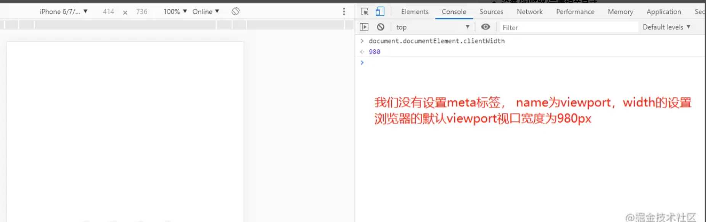
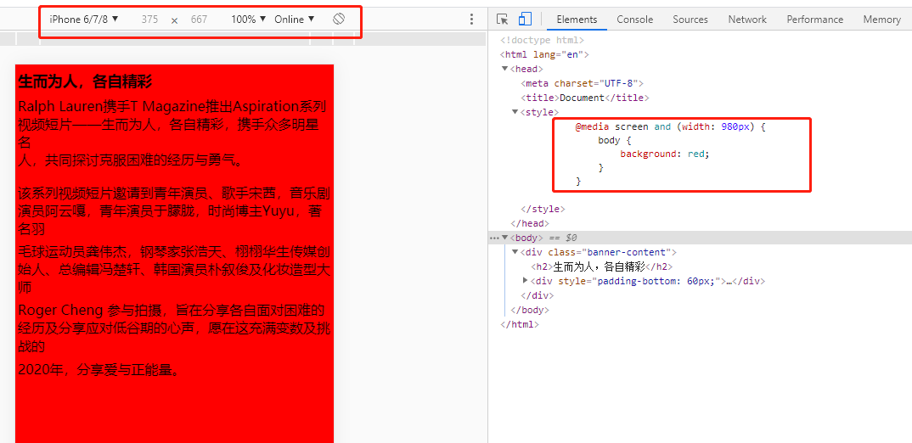

此时，我们设置body宽度为1200px, 大于移动端默认的viewport的可视宽度980结果显示，确实出现了滚动条

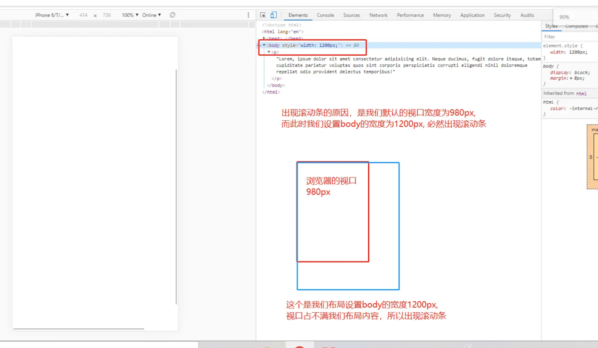

**从上图我们可以得到，在移动设备中也证实了，css中的媒体查询的宽度、高度的比较对象就是viewport的宽高**

## 移动设备适配知识点

我们做移动端的适配的时候，经常会添加这个标签，那这个标签的作用是什么呢？

`<meta name="viewport" content="width=device-width, initial-scale=1.0">`

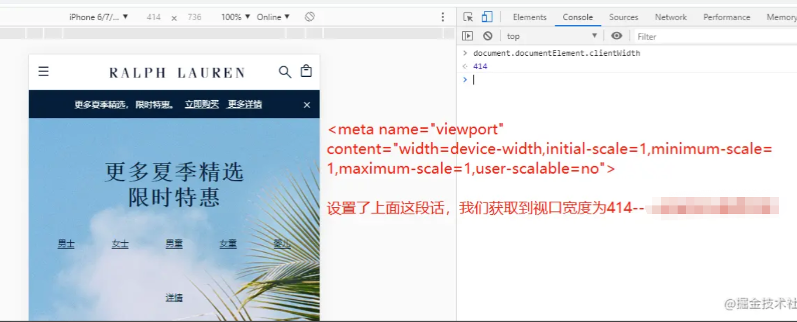

答：由上图我们可以得出，在移动端浏览器的viewport, 默认是980px,如果设置viewport标签，那么其viewport由设置决定。我们的布局宽度是相对于viewport宽度，如果布局宽度大于了viewport宽度，那么会出现滚动条，反之，则不会

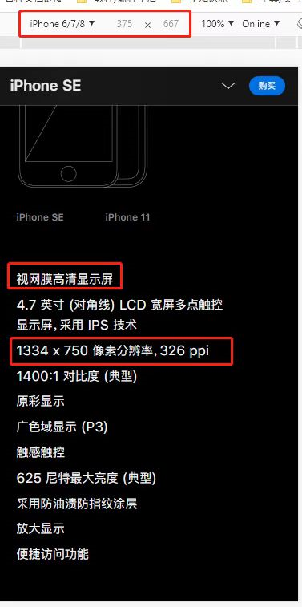

上面meta标签中content的，width, height是设置视口viewport的宽高device-width/device-height: 这个指的是用户移动设备的宽高

物理像素： iphone6/7/8的分辨率为750 * 1334， 这个代表什么呢，就是我们UI设计iphone6/7/8的视觉稿，需要新建ps画布的大小,这个我们是真实可测量的像素，我们称为物理像素

那么iphone6/7/8的viewport宽高375 * 667，这个是什么呢？怎么得出来的了，该怎么称呼呢？

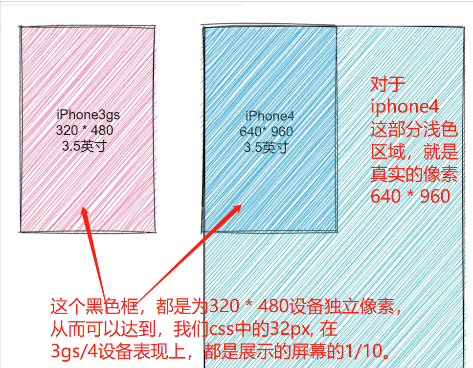

iPhone 3GS 和 iPhone 4/4s 的尺寸都是 3.5 寸,iPhone 3GS 的分辨率是 320x480,iPhone 4/4s 的分辨率是 640x960，这也就是意味着同样长度的屏幕，iPhone 3GS 有 320 个物理像素。iPhone 4/4s 有 640 个物理像素。

如果我们按照真实的物理像素进行布局，比如说我们按照 320 物理像素进行布局，到了 640 物理像素的手机上就会有一半的空白，为了避免这种问题，就产生了虚拟像素单位（设备独立像素）---不是真实存在的。

同时也出现**retina高清屏幕**：即同样的尺寸，可容纳的像素多了4倍。

**设备像素比（devicePixelRatio）**

devicePixelRatio = 物理像素/设备独立像素iphone6/7/8是 物理像素：750 * 1334 ，设备独立像素375 * 667，所以设备像素比为即一个设备独立像素对应4个真实物理像素单位。

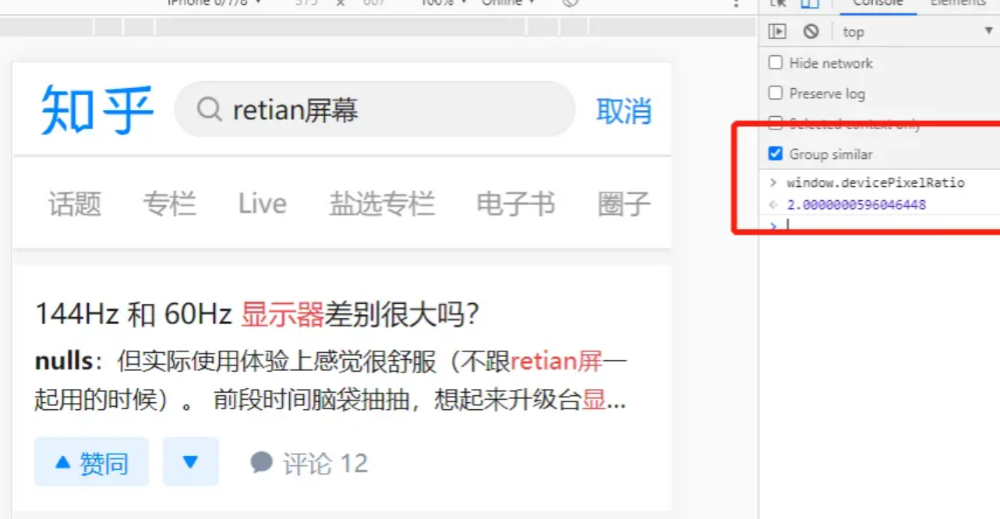

**我们在移动端适配的css的px指的是什么？**

1. 在我们设置viewport的宽度就是设备独立像素宽度，即`<meta name="viewport"content="width=device-width, initial-scale=1.0">`，那么此时对于设备像素比为2
的iphone6/7/8来说

1px(css) = 1px的独立设备像素 = 2px的真实物理像素（UI设计稿）

2. 如果一个网页，没有进行如上设置，即没有针对移动设备进行适配，那么我们写的1px到底等于多少真实物理px呢？

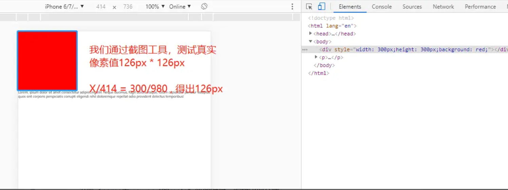

> 最后，以上是本人从书中，教程，以及各位大佬分享的博文中，学习感悟总结得出，如果错误，还请各位小伙伴指正！